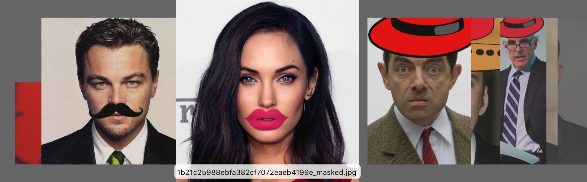

# Selfie Funhouse

## NOTE THIS IS IN PROGRESS - YMMV

### Example Output



### Design
Here is the bigger picture of what this fits into:


## About the code
It's Python2 - and it uses opencv+dlib.


## Running
### To run locally
Put some selfies into workdir/input and:
```python apply_mask.py -i workdir/input/ -o workdir/output/ -m funprops/```

### To build/run with AWS Lambda
You'll need to setup a few things in AWS as well as build a bundle.zip

I'm planning on leveraging the more generic work I'm doing here: https://github.com/dudash/aws-lambda-python-opencv
TBD...

### To add more props
You'll need to front (png) and back (jpg) files for each new prop into the `funprops` folder.  They can be any size, but they must be the same size.  The front is the prop and the back is how it should align to a face (any face will do).

-----
The Computer Vision is 99% the awesome work from here:
https://github.com/leoneckert/masks-and-hats

But I've modified it to (work on a Mac locally), be able to be run in AWS lambda, be able to use S3 for input and output, and added a bunch of props for the photos.
