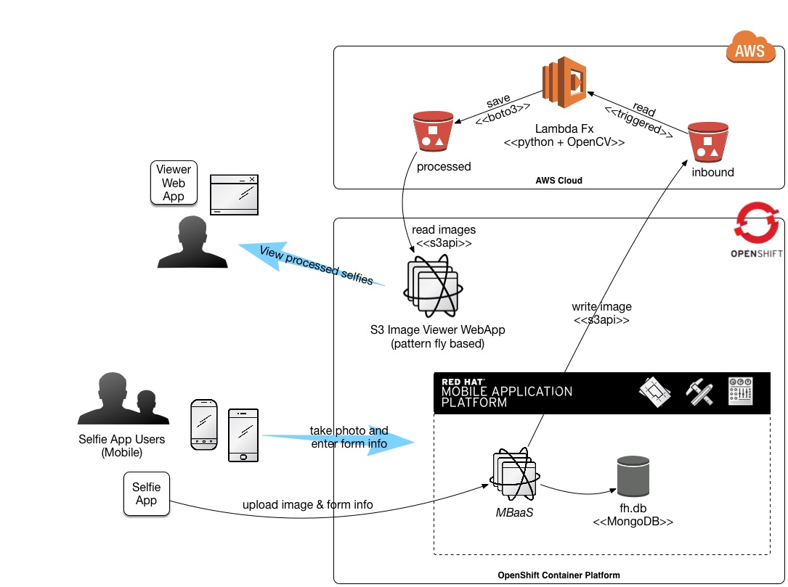

# Selfie Funhouse

THIS IS 99% THE AWESOME WORK FROM HERE:
https://github.com/leoneckert/masks-and-hats

But I've modified it to (work on a Mac locally), run in AWS lambda, use S3 for input and output, and added a bunch of props for the photos.

Here is the bigger picture of what this fits into:




## About the code
It's Python2 - and it uses opencv+dlib.

## Running
### To run locally
Put some selfies into workdir/input and:
```python apply_mask.py -i workdir/input/ -o workdir/output/ -m funprops/```

### To build/run with AWS Lambda
You'll need to setup a few things in AWS as well as build a bundle.zip

I'm planning on leveraging the more generic work I'm doing here: https://github.com/dudash/aws-lambda-python-opencv
TBD...


### To build/run with Red Hat's OpenShift

TBD.  Instructions coming soon.


Cheers,
Dudash